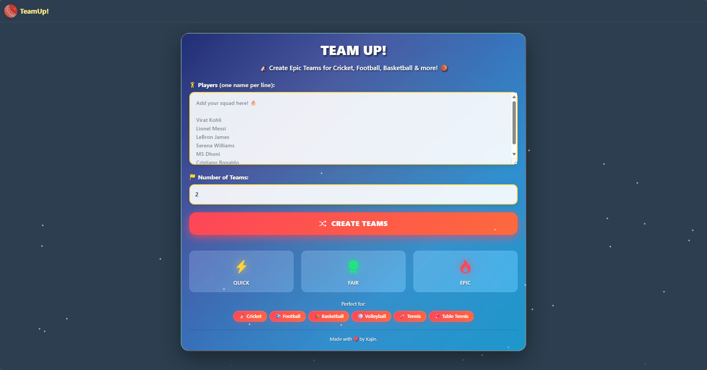
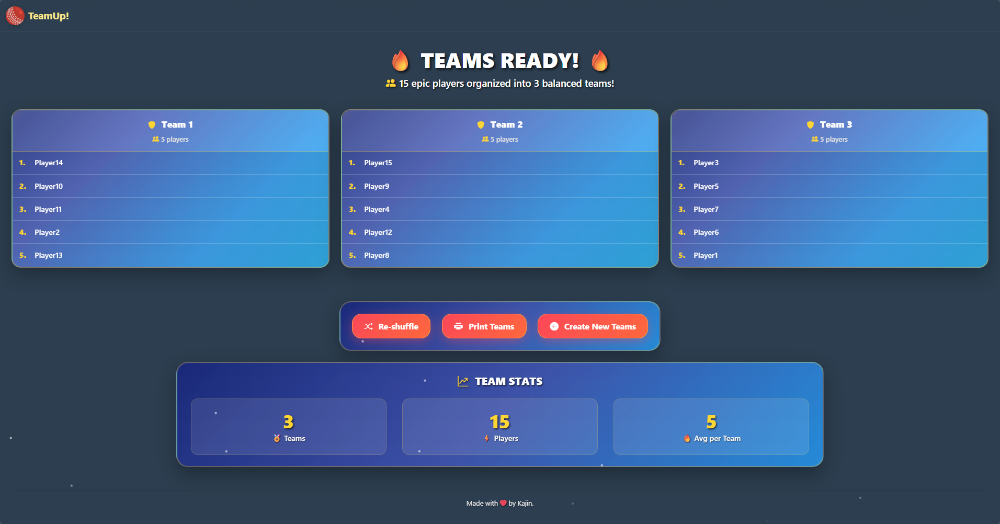

# TeamUp - Sports Team Generator 🏏⚽🏀

A Django web application that helps you create balanced teams for sports and group activities. Simply enter participant names, choose the number of teams, and let TeamUp randomly generate fair teams for your games!

## Features

- 🎯 **Random Team Generation**: Create balanced teams from a list of participants
- 🔄 **Reshuffle Teams**: Don't like the current setup? Reshuffle with one click
- 📱 **Responsive Design**: Works perfectly on desktop, tablet, and mobile devices
- 🎨 **Modern UI**: Clean and intuitive interface with sports-themed design
- ⚡ **Fast & Simple**: No account required, just enter names and go!

## Screenshots





## Getting Started

### Prerequisites

- Python 3.8 or higher
- Django 5.2.3

### Installation

1. **Clone the repository**
   ```bash
   git clone https://github.com/yourusername/teamup.git
   cd teamup
   ```

2. **Create a virtual environment**
   ```bash
   python -m venv venv
   source venv/bin/activate  # On Windows: venv\Scripts\activate
   ```

3. **Install dependencies**
   ```bash
   pip install django==5.2.3
   ```

4. **Run database migrations**
   ```bash
   python manage.py migrate
   ```

5. **Start the development server**
   ```bash
   python manage.py runserver
   ```

6. **Open your browser** and visit `http://127.0.0.1:8000`

## Usage

1. **Enter Participants**: Add participant names, one per line
2. **Choose Team Count**: Select how many teams you want to create
3. **Generate Teams**: Click "Generate Teams" to create random teams
4. **Reshuffle**: Not happy with the teams? Click "Reshuffle Teams" to try again

## Project Structure

```
TeamUp/
├── manage.py
├── db.sqlite3
├── static/
│   ├── style.css
│   ├── logo.png
│   └── favicon files
├── templates/
│   ├── base.html
│   ├── home.html
│   └── teams.html
└── TeamUp/
    ├── __init__.py
    ├── settings.py
    ├── urls.py
    ├── views.py
    ├── wsgi.py
    └── asgi.py
```

## Contributing

Contributions are welcome! Here's how you can help:

1. **Fork the repository**
2. **Create a feature branch** (`git checkout -b feature/amazing-feature`)
3. **Commit your changes** (`git commit -m 'Add some amazing feature'`)
4. **Push to the branch** (`git push origin feature/amazing-feature`)
5. **Open a Pull Request**

## Ideas for Contributions

- Add player skill level balancing
- Implement team history tracking
- Add export functionality (PDF, CSV)
- Create different sports templates
- Add player statistics
- Implement dark/light theme toggle

## License

This project is licensed under the MIT License - see the [LICENSE](LICENSE) file for details.

## Acknowledgments

- Built with [Django](https://www.djangoproject.com/)
- Icons and styling inspired by modern sports applications
- Thanks to all contributors who help make TeamUp better!

## Support

If you encounter any issues or have questions:

1. Check the [Issues](https://github.com/yourusername/teamup/issues) page
2. Create a new issue if your problem isn't already reported
3. Provide detailed information about your setup and the issue

---

**Made with ❤️ for sports enthusiasts and group organizers**

*Perfect for cricket matches, football games, basketball tournaments, classroom activities, and any situation where you need to create fair teams quickly!*
